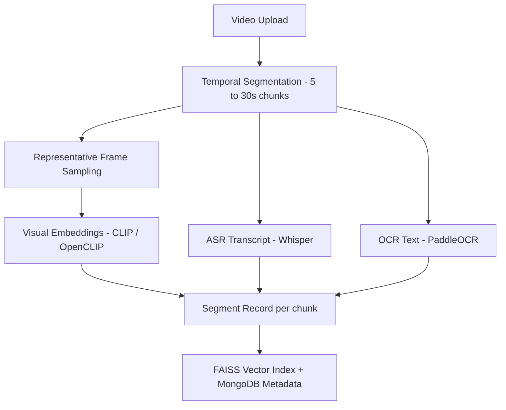
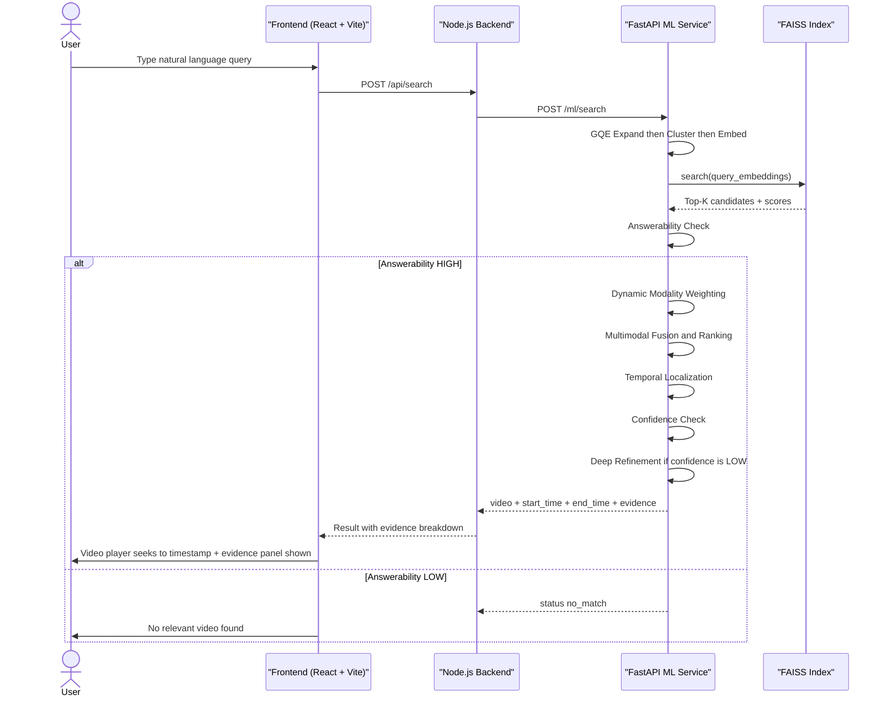

# 🎯 Project Roadmap
## Universal Semantic Video Search & Moment Retrieval
**Walchand College of Engineering, Sangli** | B.Tech CSE | 2026–27

> **Team:** Sahil Patil (23510070) · Tenzin Dargyal (23510051) · Pranav Chougule (23510105) · Vrushabh Tonge (23510118)
> **Guide:** A.S. Pawar, Assistant Professor

---

## Big Picture Overview

```mermaid
flowchart LR
    A["Phase 0 - Foundation and Setup"] --> B["Phase 1 - Offline Indexing"]
    B --> C["Phase 2 - Query Engine + ASR/OCR"]
    C --> D["Phase 3 - Dynamic Modality Weighting"]
    D --> E["Phase 4 - Answerability Detection"]
    E --> F["Phase 5 - Temporal Localization"]
    F --> G["Phase 6 - Full-Stack Integration"]
    G --> H["Phase 7 - Evaluation and Demo"]
```



---

## System Architecture Reference


*Offline indexing pipeline (left) feeds the FAISS vector index. The online query pipeline (right) runs coarse-to-fine retrieval with answerability checking and confidence-gated refinement.*

---

## Complete Technology Stack

| Layer | Technology | Purpose |
|---|---|---|
| **Frontend** | React + Vite | Search UI, result display, video player |
| **App Backend** | Node.js + Express.js | REST API, auth, job queuing, orchestration |
| **AI/ML Backend** | Python + FastAPI | All model inference (embeddings, ASR, OCR, fusion) |
| **Visual Embeddings** | CLIP / OpenCLIP | Frame-level visual understanding |
| **Speech Transcription** | Whisper (OpenAI) | ASR — convert speech to searchable text |
| **OCR** | PaddleOCR / Tesseract | Extract on-screen text from frames |
| **Query Expansion** | LLM (Hugging Face / OpenAI) | GQE-style diverse query variant generation |
| **ML Framework** | PyTorch + Hugging Face Transformers | Model hosting and inference |
| **Vector Search** | FAISS | Fast approximate nearest-neighbor retrieval |
| **Database** | MongoDB | Video, segment, query, result metadata |
| **Job Queue** | Redis + BullMQ | Async background indexing pipeline |
| **Evaluation Datasets** | QVHighlights, Charades-STA | Benchmark moment retrieval |

---

## Phase-by-Phase Detailed Roadmap

---

### PHASE 0 — Foundation and Environment Setup
**Duration:** Days 1–3 | Parallel to Week 1

> [!IMPORTANT]
> This is the bedrock. Skipping proper setup causes technical debt throughout the project.

#### Step 0.1 — Repository and Project Structure
- [ ] Create a monorepo with three workspaces: `/frontend`, `/backend`, `/ml-service`
- [ ] Initialize `git` with a `.gitignore` for Python, Node, and model weights
- [ ] Set up a shared `README.md` with architecture overview

#### Step 0.2 — Environment Setup
- [ ] **Python ML Service:** Create a `venv` or `conda` environment; install PyTorch, FastAPI, Uvicorn, CLIP, Whisper, PaddleOCR, FAISS, Hugging Face Transformers
- [ ] **Node Backend:** `npm init`, install Express, BullMQ, Mongoose, dotenv, multer (video upload)
- [ ] **React Frontend:** `npm create vite@latest frontend -- --template react-ts`
- [ ] **MongoDB:** Set up local MongoDB instance or MongoDB Atlas free tier
- [ ] **Redis:** Install Redis locally via Docker: `docker run -d -p 6379:6379 redis`

#### Step 0.3 — Dataset Acquisition
- [ ] Download **QVHighlights** dataset (video moment retrieval benchmark)
- [ ] Download **Charades-STA** dataset (activity temporal grounding)
- [ ] Organize into `/data/qvhighlights/` and `/data/charades/` directories
- [ ] Understand annotation format: `(query, video_id, start_time, end_time)`

#### Step 0.4 — API Contract Definition
- [ ] Define all REST API endpoints between frontend, Node backend, and FastAPI
- [ ] Document MongoDB schema for: `videos`, `segments`, `queries`, `results`
- [ ] Write OpenAPI/Swagger spec for the FastAPI ML service

**Deliverable:** All three services run locally. Team can `git clone` and start immediately.

---

### PHASE 1 — Offline Multimodal Indexing Pipeline
**Duration:** Week 2 to Week 3 | Approach A

> This is the most computationally heavy phase. It runs **once per video** as a background job and populates the FAISS index.



#### Step 1.1 — Video Upload and Storage (Node Backend)
- [ ] Build `POST /api/videos/upload` endpoint using `multer` for multipart upload
- [ ] Save video file to disk `/storage/videos/` and create a MongoDB `video` document
- [ ] Enqueue a BullMQ indexing job: `indexingQueue.add('index-video', { videoId })`
- [ ] Return `{ videoId, status: 'queued' }` to frontend immediately

#### Step 1.2 — Temporal Segmentation (Python ML Service)
- [ ] Use `ffprobe` to get video duration, then split into fixed-length chunks (e.g., 10s with 2s overlap)
- [ ] Use OpenCV or `ffmpeg-python` to extract frames: 1 to 3 representative frames per chunk
- [ ] Output: list of `{ chunk_id, start_time, end_time, frame_paths[] }`

#### Step 1.3 — Visual Embedding Extraction (CLIP/OpenCLIP)
- [ ] Load `ViT-B/32` or `ViT-L/14` CLIP model via `open_clip`
- [ ] For each chunk, extract embeddings for sampled frames, then **mean-pool** across frames
- [ ] Normalize to unit vector and store as `visual_embedding: float[512]` or `float[768]`

#### Step 1.4 — Speech Transcription (Whisper)
- [ ] Load `whisper.load_model("base")` or `"small"` (trade-off: speed vs accuracy)
- [ ] Transcribe the full video audio to get word-level timestamps
- [ ] Map transcript segments to video chunks using timestamp overlap
- [ ] Encode the transcript of each chunk using CLIP text encoder to get `speech_embedding`

#### Step 1.5 — OCR Text Extraction (PaddleOCR)
- [ ] Run PaddleOCR on each sampled frame
- [ ] Concatenate detected text per chunk and encode with CLIP text encoder to get `ocr_embedding`
- [ ] Handle empty OCR gracefully (zero vector or skip flag)

#### Step 1.6 — FAISS Index Construction
- [ ] Create three separate FAISS `IndexFlatIP` (inner product) indices:
  - `faiss_visual.index` — visual embeddings
  - `faiss_speech.index` — speech embeddings
  - `faiss_ocr.index` — OCR embeddings
- [ ] Store all three embeddings and metadata in MongoDB `segments` collection
- [ ] Save FAISS indices to disk after each video is processed

#### Step 1.7 — BullMQ Worker (Node Backend)
- [ ] Write a BullMQ worker that picks up `index-video` jobs
- [ ] Worker calls FastAPI `/ml/index` endpoint with `videoId`
- [ ] Update MongoDB `video.status` from `'indexing'` to `'indexed'` on completion
- [ ] Handle failures: retry logic, error status, notifications

**Deliverable:** Upload a video → background job runs → segments appear in FAISS + MongoDB. Visual-only retrieval works as a baseline.

---

### PHASE 2 — Query Expansion, Clustering and ASR/OCR Integration
**Duration:** Week 3 to Week 4 | Approach B Part 1


#### Step 2.1 — Query Understanding and GQE-Style Expansion
- [ ] Build `POST /ml/query/expand` FastAPI endpoint
- [ ] Input: raw user query string
- [ ] Use an LLM (e.g., `flan-t5-base` locally, or GPT-3.5 via API with caching) to generate 5 to 10 semantically diverse query variants
  - Example: "find where the professor explains gradient descent" generates:
    - "moment showing backpropagation explanation"
    - "lecture slide about loss function"
    - "professor drawing cost curve on board"
- [ ] Cache LLM results in MongoDB keyed by query hash to reduce API costs

#### Step 2.2 — Adaptive Query Clustering and Selection
- [ ] Embed all query variants with CLIP text encoder
- [ ] Apply **K-Means clustering** (K=3) on variant embeddings
- [ ] Select one representative variant per cluster (closest to centroid)
- [ ] Output: 3 representative query embeddings instead of 10 (reduces redundant FAISS calls by ~70%)

#### Step 2.3 — Modality-Type Classifier
- [ ] Build a lightweight classifier that predicts which modality is most relevant to a query:
  - Visual-dominant (e.g., "show the red car")
  - Speech-dominant (e.g., "find the explanation of X")
  - OCR-dominant (e.g., "find where the code shows Y")
- [ ] Can be rule-based initially (keyword heuristics) and upgraded to trained classifier later

#### Step 2.4 — Fixed-Weight Multimodal Fusion Baseline
- [ ] Retrieve Top-K candidates from all three FAISS indices using representative queries
- [ ] Merge candidate lists and compute **fixed-weight fusion score**:
  ```
  score = 0.33 * visual_sim + 0.33 * speech_sim + 0.33 * ocr_sim
  ```
- [ ] Rank and return Top-5 results
- [ ] This is the **baseline** for ablation comparison against dynamic weighting in Phase 3

**Deliverable:** User can type a query, system expands it, retrieves candidates from all 3 modalities, and returns fixed-weight ranked results. End-to-end flow works.

---

### PHASE 3 — Dynamic Query-Conditioned Modality Weighting
**Duration:** Week 4 to Week 5 | Approach B Part 2 and Approach C Part 1

> [!NOTE]
> This is the **core novel contribution** of the project. It directly addresses the research gap identified in the literature review.

#### Step 3.1 — Design the Modality Weighting Module
- [ ] Architecture: a small MLP or attention-based network
  - Input: query embedding (512-dim) + modality score vector (3-dim)
  - Output: 3 weights `[w_visual, w_speech, w_ocr]` that sum to 1.0 (softmax output)
- [ ] The weights are **per-query** — not global fixed weights

#### Step 3.2 — Training the Weighting Module
- [ ] Use QVHighlights annotations as training signal:
  - Ground truth moment determines which modality would have found it, creating a soft label
- [ ] Loss: cross-entropy on modality label + retrieval ranking loss (e.g., triplet loss)
- [ ] Train with PyTorch, log metrics with TensorBoard or Weights and Biases

#### Step 3.3 — Integration into Query Pipeline
- [ ] Replace fixed-weight fusion with the trained weighting module
- [ ] Pipeline flow:
  ```
  query_emb → WeightingModule → [w_v, w_s, w_o]
  fused_score = w_v * visual_sim + w_s * speech_sim + w_o * ocr_sim
  ```
- [ ] Return per-modality weights in the API response for explainability

#### Step 3.4 — Ablation Experiment (Fixed vs Dynamic)
- [ ] Evaluate both approaches on QVHighlights test split
- [ ] Metrics: **R@1, R@5** (retrieval), **mIoU** (temporal overlap)
- [ ] Document improvement delta in an ablation table

**Deliverable:** Dynamic modality weighting works and demonstrably outperforms fixed-weight baseline.

---

### PHASE 4 — Answerability Detection
**Duration:** Week 5 to Week 6 | Approach C Part 2

> [!IMPORTANT]
> This prevents the system from returning a "best guess" when nothing relevant exists — a critical reliability feature that sets this project apart.

#### Step 4.1 — Define Answerability Signals (Cheap-First Strategy)

Three signals, evaluated in order (escalate only if previous is ambiguous):

| Signal | Cost | Description |
|---|---|---|
| **Signal 1: Score Gap** | Very cheap | If best candidate score is far below threshold → unanswerable |
| **Signal 2: Inter-Modality Agreement** | Cheap | If visual, speech, OCR rankings disagree badly → uncertain |
| **Signal 3: Cross-Modal Re-ranking** | Moderate | Use LLM or cross-encoder to verify best candidate relevance |

#### Step 4.2 — Threshold Calibration
- [ ] Create a **labeled evaluation set**:
  - Answerable queries: queries that match a video in the corpus
  - Unanswerable queries: queries with no relevant video in the corpus
- [ ] Use 200+ unanswerable queries from QVHighlights negative set
- [ ] Sweep threshold values and plot Precision-Recall curve
- [ ] Pick threshold that maximizes F1-score

#### Step 4.3 — Integration into Pipeline
- [ ] Add answerability gate **after** FAISS retrieval, **before** expensive fusion:
  ```python
  if answerability_score < THRESHOLD:
      return { "status": "no_match", "message": "No relevant video found" }
  else:
      # proceed to modality fusion and localization
  ```
- [ ] Return confidence score in API response: `{ answerability: 0.82, ... }`

#### Step 4.4 — Evaluation
- [ ] Measure **Precision, Recall, F1** on the labeled answerable/unanswerable set
- [ ] Document false positive rate (wrongly rejecting answerable queries)

**Deliverable:** System correctly says "no match found" for irrelevant queries instead of returning a wrong answer. F1 score measured and documented.

---

### PHASE 5 — Temporal Localization and Confidence-Gated Refinement
**Duration:** Week 6 to Week 7 | Approach C Part 3


#### Step 5.1 — Coarse Temporal Localization
- [ ] After fusion score ranks candidate segments, the top segment gives a **coarse window** `[start, end]`
- [ ] This is already produced by Phase 1 segmentation (chunk boundaries)
- [ ] Output: predicted `start_time`, `end_time`, and a `localization_confidence` score

#### Step 5.2 — Confidence Score Computation
- [ ] Confidence = function of:
  - Max fusion score vs second-best score gap
  - Inter-modality agreement on the predicted window
  - Overlap between query expansion variants' top results
- [ ] Map to `[0.0, 1.0]` scale
- [ ] Define confidence threshold tau (e.g., 0.65)

#### Step 5.3 — Confidence-Gated Refinement Pass
- [ ] **Only triggered when confidence is below tau**:
  - Narrow search window: re-segment the top video at **finer granularity** (1 to 3s chunks)
  - Re-run visual + speech embedding extraction on finer chunks
  - Re-score against query to produce refined `start_time`, `end_time`
- [ ] Inspired by **ConfDiff** (Zhao and Wang, 2026) from the literature
- [ ] Track what percentage of queries trigger refinement (target: below 20% for efficiency)

#### Step 5.4 — Final Output Construction

```json
{
  "video_id": "vid_001",
  "video_title": "Lecture on Gradient Descent",
  "start_time": 142.3,
  "end_time": 158.7,
  "answerability_score": 0.88,
  "localization_confidence": 0.72,
  "refinement_triggered": false,
  "evidence": {
    "visual_weight": 0.55,
    "speech_weight": 0.35,
    "ocr_weight": 0.10,
    "visual_similarity": 0.81,
    "speech_similarity": 0.74,
    "ocr_similarity": 0.22
  }
}
```

**Deliverable:** System returns precise timestamps with confidence score. Expensive refinement is only triggered for uncertain cases.

---

### PHASE 6 — Full-Stack Web Integration
**Duration:** Week 7 (parallel with Phase 5)


#### Step 6.1 — React Frontend (Vite)
- [ ] **Upload Page:** Drag-and-drop video upload, real-time indexing status tracker via polling
- [ ] **Search Page:** Natural language query input, search button, loading state animations
- [ ] **Result Page:**
  - Embedded HTML5 video player that **auto-seeks** to `start_time`
  - Highlight bar showing the predicted temporal window overlaid on the video timeline
  - Evidence breakdown panel with visual / speech / OCR weight progress bars
  - Answerability score badge with color coding (green = high, red = low)
  - "No relevant video found" state card when answerability is low

#### Step 6.2 — Node.js Backend (Express)
- [ ] `POST /api/videos/upload` — handle video upload, enqueue BullMQ job
- [ ] `GET /api/videos/:id/status` — poll indexing status
- [ ] `POST /api/search` — proxy to FastAPI ML service, return results
- [ ] `GET /api/videos` — list all indexed videos
- [ ] JWT-based authentication: Admin role (upload/manage) vs User role (search only)

#### Step 6.3 — FastAPI ML Service Routes
- [ ] `POST /ml/index` — trigger offline indexing pipeline for a video
- [ ] `POST /ml/search` — run full online query pipeline, return result JSON
- [ ] `GET /ml/health` — health check endpoint
- [ ] Add async request handling so heavy inference does not block other requests

#### Step 6.4 — End-to-End Integration Test
- [ ] Upload 5 test videos from QVHighlights subset
- [ ] Run 20 test queries through the full UI and verify correct timestamp results
- [ ] Fix any API contract mismatches between layers

**Deliverable:** Complete working web application that is demo-ready.

---

### PHASE 7 — Evaluation, Ablations, Documentation and Demo
**Duration:** Week 7 to Week 8

#### Step 7.1 — Quantitative Evaluation on QVHighlights and Charades-STA

| Metric | Description | Target |
|---|---|---|
| **R@1 (IoU >= 0.5)** | Retrieval recall at rank 1 | > 45% |
| **R@5 (IoU >= 0.5)** | Retrieval recall at top 5 | > 70% |
| **mIoU** | Mean temporal overlap | > 0.45 |
| **Answerability F1** | Precision and Recall on no-match detection | > 0.75 |
| **Query Latency** | Average end-to-end search time | < 3 seconds |
| **Refinement Rate** | Percentage of queries needing deep refinement | < 20% |

#### Step 7.2 — Ablation Study Table

| System Variant | R@1 | mIoU | Notes |
|---|---|---|---|
| Visual-only (no fusion) | — | — | Baseline |
| Fixed-weight fusion (0.33 each) | — | — | Baseline |
| Dynamic modality weighting | — | — | **Proposed** |
| Dynamic + answerability gate | — | — | **Proposed + safety** |
| Dynamic + gate + confidence refinement | — | — | **Full system** |

#### Step 7.3 — Documentation
- [ ] Write system design document (`docs/architecture.md`)
- [ ] Write API reference (`docs/api.md`)
- [ ] Write model cards for each component (CLIP, Whisper, OCR, weighting module)
- [ ] Write final project report that maps back to all 5 synopsis objectives

#### Step 7.4 — Demo Preparation
- [ ] Prepare a **5-minute live demo video** showing:
  1. Upload a new video and watch indexing complete in real time
  2. Query a speech-heavy question and show speech weight dominating
  3. Query a visual action question and show visual weight dominating
  4. Query something not in the corpus and show "no match found" response
  5. Show confidence-gated refinement kicking in for an ambiguous case
- [ ] Prepare presentation slides for final review

**Deliverable:** Full evaluation results, ablation tables, documentation, and polished demo video.

---

## Complete Pipeline Flow



---

## Team Division of Work

| Member | Primary Responsibility |
|---|---|
| **Sahil Patil** | ML Service Lead — CLIP/Whisper/OCR indexing, FAISS, modality weighting module |
| **Tenzin Dargyal** | Query Pipeline — GQE expansion, clustering, answerability module |
| **Pranav Chougule** | Backend Lead — Node.js/Express, BullMQ job queue, MongoDB schemas, auth |
| **Vrushabh Tonge** | Frontend Lead — React/Vite UI, video player, evidence dashboard |

> [!TIP]
> Hold a **30-minute sync every 2 days** to review API contracts between services. This is the most common source of integration bugs.

---

## Key Risks and Mitigations

| Risk | Impact | Mitigation |
|---|---|---|
| GPU not available for CLIP / Whisper | HIGH | Use Google Colab or Kaggle free GPUs for indexing; CPU-only FAISS search works fine |
| LLM API cost for query expansion | MEDIUM | Cache all LLM outputs by query hash; use local `flan-t5-base` as fallback |
| Modality weighting model does not converge | MEDIUM | Fall back to fixed-weight fusion; still publishable as ablation study |
| Whisper transcription too slow | MEDIUM | Use `whisper-tiny` or `whisper-base`; batch-process in the offline pipeline |
| QVHighlights dataset download issues | LOW | Mirror datasets on team Google Drive early in Week 1 |
| MongoDB or Redis not running locally | LOW | Use Docker Compose to spin up all services with a single command |

---

## 8-Week Sprint Calendar

| Week | Primary Focus | Exit Criteria |
|---|---|---|
| **Week 1** | Setup, datasets, literature review, API contracts | All 3 services run locally; QVHighlights downloaded |
| **Week 2** | Temporal segmentation + CLIP visual embeddings + FAISS | Visual-only retrieval returns ranked results |
| **Week 3** | Whisper ASR + PaddleOCR + BullMQ async worker | All 3 modalities indexed; background job works |
| **Week 4** | GQE query expansion + clustering + fixed-weight fusion baseline | End-to-end query returns multimodal results |
| **Week 5** | Dynamic modality weighting module trained and integrated | Dynamic weighting outperforms fixed-weight on test set |
| **Week 6** | Answerability detection module + threshold calibration | Answerability F1 exceeds 0.70 on labeled set |
| **Week 7** | Temporal localization + confidence-gated refinement + React UI | Full demo works end-to-end in the browser |
| **Week 8** | Quantitative evaluation + ablations + documentation + demo video | All metrics measured and final report written |

---

> [!NOTE]
> **SDG 9 — Industry, Innovation and Infrastructure:** This project builds reusable, domain-agnostic multimodal search infrastructure applicable across e-learning platforms, media archives, and enterprise content repositories.

---

*Roadmap generated from Final Synopsis — Universal Semantic Video Search and Moment Retrieval*
*Walchand College of Engineering, Sangli — B.Tech CSE 2026–27*
