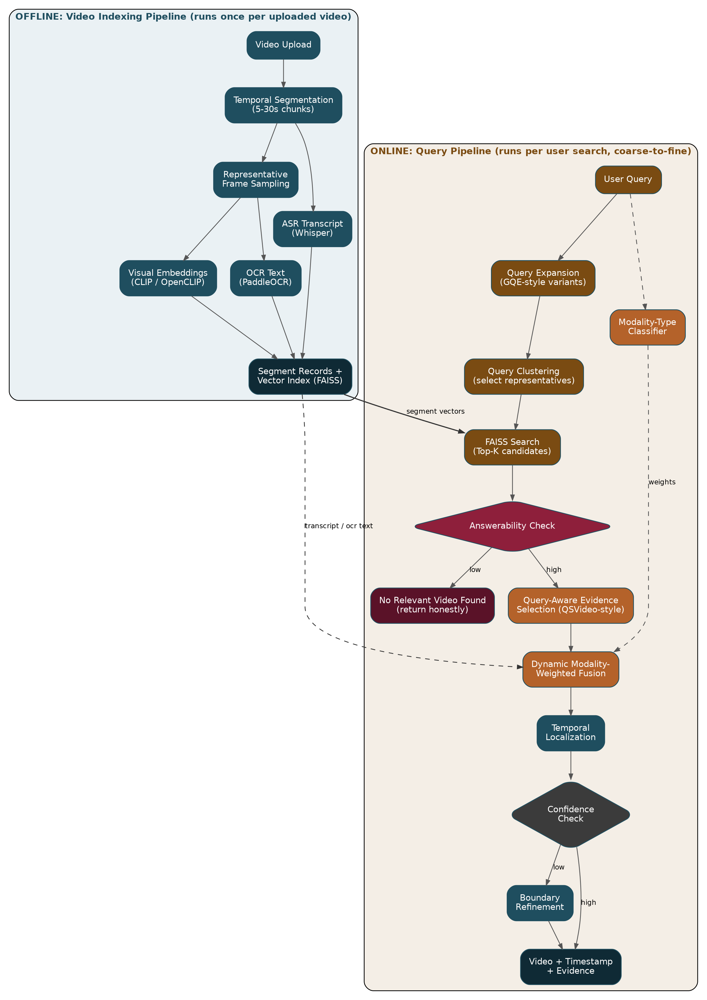
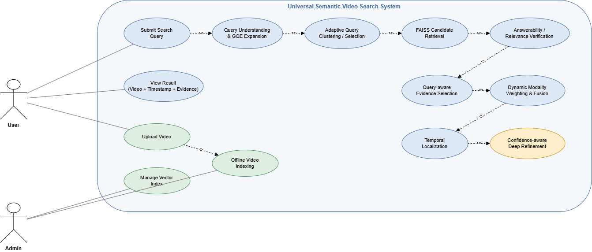
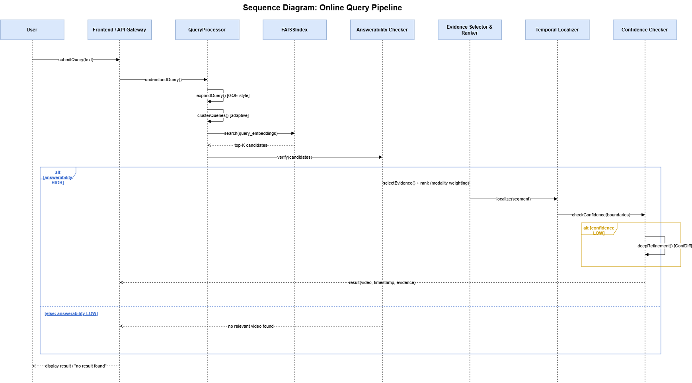
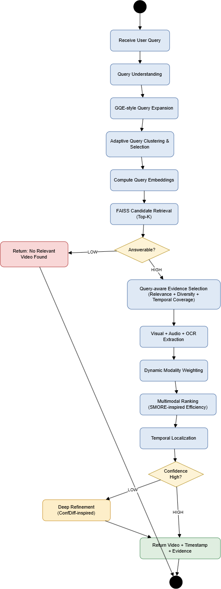

::: titlepage
{width="2.6cm"}\
**Walchand College of Engineering, Sangli**\
(Government Aided Autonomous Institute)\
Department of Computer Science and Engineering\

------------------------------------------------------------------------

\
**Project Synopsis**\

------------------------------------------------------------------------

\
**Universal Semantic Video Search & Moment Retrieval**\
**Bachelor of Technology**\
in\
**Computer Science and Engineering**\
**Submitted by**\

  ----------------- ----------
  Sahil Patil       23510070
  Tenzin Dargyal    23510051
  Pranav Chougule   23510105
  Vrushabh Tonge    23510118
  ----------------- ----------

\
**Under the Guidance of**\
A.S. Pawar\
Assistant Professor\

2026--27
:::

# 1. Introduction {#introduction .unnumbered}

## 1.1 Background {#background .unnumbered}

Online and institutional video repositories have grown far faster than
the tools available to search inside them. A lecture recording, a
tutorial, a sports broadcast, or an interview may run for an hour or
more, yet the information a user actually wants -- a specific
explanation, an action, or a visual detail -- is often confined to a few
seconds of that video. Existing video search largely relies on titles,
tags, or manually written descriptions, none of which capture what is
actually happening inside the video at a fine-grained, moment level.
This creates a large gap between what users want to ask ("find the part
where X happens") and what current systems can answer.

## 1.2 Motivation {#motivation .unnumbered}

Manually scrubbing through long videos to locate a specific moment is
slow and unreliable, and it does not scale as video libraries grow. A
video inherently carries multiple layers of information -- visual
content, spoken narration, and on-screen text -- and different queries
depend on different combinations of these layers. A query about a spoken
explanation should rely on speech; a query about a physical action
should rely on visuals; a query about on-screen code or slides should
rely on text recognition. No single fixed strategy serves all queries
equally well, and nearest-neighbor retrieval alone will always return
*some* result even when nothing relevant actually exists in the corpus.
This motivates a system that adapts its retrieval strategy to the query
itself and is able to recognize when it does not have a confident
answer, rather than silently returning the closest -- but wrong --
match.

## 1.3 Problem Statement {#problem-statement .unnumbered}

Develop a multimodal system to retrieve the most relevant video and
precisely localize the answer-bearing moment using adaptive visual,
speech, and text evidence. Given an arbitrary natural-language query and
a heterogeneous collection of videos spanning multiple domains, retrieve
the most relevant video and the precise start and end timestamp of the
moment that answers the query, using a combination of visual, speech.
The system must adaptively decide how much to trust each evidence type
per query, verify that a genuinely relevant result exists before
returning one, and spend additional computation on temporal refinement
only when its initial prediction is not confident.

# 2. Customer Connect Details {#customer-connect-details .unnumbered}

## 2.1 Customer Name {#customer-name .unnumbered}

## 2.2 Contact Person {#contact-person .unnumbered}

## 2.3 Email / Phone {#email-phone .unnumbered}

## 2.4 Nature of Engagement {#nature-of-engagement .unnumbered}

Periodic review meetings with the project guide for problem scoping,
methodology validation, and progress evaluation at each phase of the
roadmap.

# 3. Literature Review {#literature-review .unnumbered}

::: enumerate
**[Jeong et al., 2025 -- "VideoRAG: Retrieval-Augmented Generation over
Video Corpus."](https://aclanthology.org/2025.findings-acl.1096/)**

Proposes a VideoRAG framework that dynamically retrieves query-relevant
videos and combines visual and textual information for answer
generation. It uses informative frame selection and ASR-based textual
extraction when subtitles are unavailable.

*Limitation:* Focuses primarily on video retrieval and answer generation
and does not explicitly provide corpus-level answerability detection or
precise temporal moment localization.

**[Ren et al., 2025 -- "VideoRAG: Retrieval-Augmented Generation with
Extreme Long-Context Videos."](https://arxiv.org/abs/2502.01549)**

Proposes a dual-channel VideoRAG framework combining graph-based textual
knowledge grounding with multimodal video representations for extremely
long and multiple videos. It performs query reformulation, graph-based
retrieval, visual retrieval, and LLM-based filtering to identify
relevant video content.

*Limitation:* Primarily targets long-context video understanding and
RAG-based answer generation; it does not explicitly model corpus-level
answerability or provide a dedicated coarse-to-fine temporal
localization mechanism.

**[Bai et al., 2025 -- "Bridging Information Asymmetry in Text-Video
Retrieval: A Data-Centric
Approach."](https://proceedings.iclr.cc/paper_files/paper/2025/hash/6b8c6f846c3575e1d1ad496abea28826-Abstract-Conference.html)**

Proposes a text-enrichment framework that generates event-level captions
during training and diverse query variants during retrieval. A
query-selection mechanism selects relevant and diverse queries to
improve text-video retrieval while reducing redundant retrieval
computation.

*Limitation:* Focuses on text-video retrieval and query enrichment
rather than precise temporal moment localization, multimodal modality
fusion, or corpus-level answerability detection.

**[Luo et al., 2025 -- "Video-RAG: Visually-aligned Retrieval-Augmented
Long Video Comprehension."](https://arxiv.org/abs/2411.13093)**

Proposes a training-free Video-RAG pipeline that extracts visually
aligned auxiliary information from videos, including ASR, OCR, and
object detection. These auxiliary texts are retrieved and combined with
video frames and the query to improve long-video understanding while
reducing computational requirements.

*Limitation:* The framework is designed mainly to enhance LVLM-based
long-video comprehension and does not explicitly learn query-conditioned
weights across independently indexed modalities or perform corpus-level
answerability detection.

**[Jeon et al., 2026 -- "See More, Store Less: Memory-Efficient
Resolution for Video Moment
Retrieval."](https://aclanthology.org/2026.findings-eacl.87/)**

Proposes SMORE to improve memory-efficient video moment retrieval using
query-guided captions, query-aware importance modulation, and structured
visual compression. The method preserves important visual information
while reducing redundant frames.

*Limitation:* The framework introduces additional processing latency and
its accuracy can degrade for highly ambiguous videos or queries. It
mainly focuses on memory-efficient visual retrieval rather than
multimodal fusion and corpus-level answerability.

**[Zhao and Wang, 2026 -- "ConfDiff: Confidence-Guided Representation
Diffusion for Video Moment
Retrieval."](https://openaccess.thecvf.com/content/CVPR2026F/html/Zhao_ConfDiff_Confidence-Guided_Representation_Diffusion_for_Video_Moment_Retrieval_CVPRF_2026_paper.html)**

Proposes a confidence-guided diffusion framework that models temporal
boundaries as uncertain representations and selectively refines
low-confidence temporal regions. The method uses a confidence map to
allocate refinement effort to ambiguous parts of the video.

*Limitation:* Primarily addresses temporal boundary refinement after
visual-text alignment and does not address corpus-level retrieval,
multimodal evidence fusion across independently indexed modalities, or
answerability detection.

**[Ao, Wang, and Boddeti, 2026 -- "QSVideo: Query-Conditioned Semantic
Temporal Retrieval for Video
Understanding."](https://arxiv.org/abs/2607.04559)**

Proposes QSRanker and QSRetrieval for query-conditioned visual evidence
retrieval. QSRanker reformulates questions into retrieval-friendly
queries and evaluates Object, Action, and Location relevance, while
QSRetrieval balances relevance, diversity, and temporal coverage.

*Limitation:* Primarily operates on visual evidence and does not
explicitly integrate independently indexed speech and OCR modalities or
determine whether a relevant answer exists in the entire corpus.
:::

## 3.1 Research Gap {#research-gap .unnumbered}

The reviewed works address different important aspects of video
retrieval and understanding. VideoRAG introduces multimodal video
retrieval and grounded answer generation, while the extreme long-context
VideoRAG focuses on graph-based knowledge grounding and retrieval across
long and multiple videos. The data-centric text-video retrieval approach
improves query representation through query enrichment and diverse query
selection. Video-RAG further introduces visually aligned auxiliary
information such as ASR, OCR, and object detection for efficient
long-video understanding. SMORE addresses memory-efficient video moment
retrieval through query-guided captions and structured visual
compression. ConfDiff focuses on uncertainty-aware temporal boundary
refinement, while QSVideo improves query-conditioned visual evidence
selection by balancing relevance, diversity, and temporal coverage.

However, these approaches address these capabilities largely as separate
components. They do not provide a unified coarse-to-fine framework that
combines **multimodal evidence indexing, query expansion, dynamic
modality weighting, corpus-level answerability detection, and
confidence-gated temporal refinement**.

The proposed system addresses this gap by integrating visual, speech,
and OCR evidence into a common retrieval framework. It generates diverse
query interpretations, dynamically determines the importance of each
modality according to the query, verifies whether a relevant answer
actually exists in the corpus, and performs additional temporal
refinement only when the initial localization confidence is low.

Thus, the proposed work aims to provide a more reliable, explainable,
and computationally efficient semantic video search system capable of
returning the relevant video and precise temporal moment, while
explicitly handling queries for which no confident evidence exists.

# 4. Objectives {#objectives .unnumbered}

1.  To study existing multimodal video retrieval, video moment
    retrieval, VideoRAG, and multimodal fusion techniques and identify
    their limitations in heterogeneous video collections.

2.  To investigate the effectiveness of query-conditioned dynamic
    weighting of visual, speech (ASR), and on-screen text (OCR) evidence
    compared with fixed-weight multimodal fusion.

3.  To design a domain-agnostic coarse-to-fine multimodal video
    retrieval framework with answerability detection and adaptive query
    expansion for efficient retrieval.

4.  To implement confidence-gated temporal localization that performs
    additional temporal refinement only when the initial prediction is
    uncertain.

5.  To experimentally evaluate the proposed system across heterogeneous
    video domains using retrieval, temporal localization, answerability,
    and computational efficiency metrics.

# 5. Sustainable Development Goal (SDG) Mapping {#sustainable-development-goal-sdg-mapping .unnumbered}

This project is mapped to the following Sustainable Development Goal, in
consultation with the project guide:

**Mapped SDG:** 9 -- Industry, Innovation, and Infrastructure

**Justification:** The proposed project supports SDG 9 through the
development of a software-based, adaptive information-retrieval
infrastructure for multimodal video content. Video is one of the
fastest-growing forms of digital data, and existing search
infrastructure indexes videos only at the level of titles, tags, or
manual descriptions, leaving the actual visual, spoken, and on-screen
content effectively unsearchable at a fine-grained level. The proposed
system introduces an automated, coarse-to-fine retrieval pipeline that
combines multiple evidence sources -- visual embeddings, speech
transcripts, and on-screen text -- with a novel adaptive decision layer
that determines per-query modality trust, verifies whether a genuinely
relevant result exists before committing further computation, and gates
expensive refinement behind a confidence check. This directly supports
SDG 9's emphasis on fostering innovation and building resilient,
efficient technological infrastructure, and the resulting architecture
is designed to be domain-agnostic, making it a reusable and scalable
piece of software infrastructure applicable across e-learning platforms,
media archives, enterprise content repositories, and other organizations
that need to make large video collections searchable.

# 6. Scope of the Project {#scope-of-the-project .unnumbered}

**Included in scope:**

- Natural-language text query understanding, expansion, and clustering.

- Offline multimodal indexing of uploaded videos: temporal segmentation,
  visual embeddings (CLIP/OpenCLIP), speech transcription (Whisper), and
  on-screen text extraction (OCR).

- Fast approximate nearest-neighbor candidate retrieval using FAISS.

- Answerability detection to reject queries with no relevant match in
  the corpus.

- Dynamic, query-conditioned modality weighting for multimodal fusion.

- Temporal localization of the exact relevant moment, with
  confidence-gated refinement.

- A web-based demonstration interface (React + Vite) backed by a
  Node.js/Express application layer and a Python/FastAPI AI/ML service.

- Evaluation across at least two to three heterogeneous, publicly
  available video datasets.

**Excluded from scope:**

- Real-time processing of live video streams.

- Cross-lingual or multi-language query support (English only in this
  scope).

- Full diffusion-based boundary refinement (treated as optional future
  work, attempted only if the simpler refinement approach proves
  insufficient).

- Large-scale production deployment across millions of videos; the
  system is validated at a research/prototype scale.

- Native mobile applications.

# 7. Proposed Methodology {#proposed-methodology .unnumbered}

## 7.1 System Architecture / Approach {#system-architecture-approach .unnumbered}

The proposed system is organized around three complementary approaches,
each targeting a distinct stage of the retrieval problem.

1.  **Approach A -- Offline Multimodal Indexing:**

    Every uploaded video is temporally segmented into short chunks. Each
    chunk is represented by three parallel evidence embeddings -- visual
    (CLIP/OpenCLIP), speech transcript (Whisper), and on-screen text
    (OCR) -- which are normalized into a common per-segment record and
    stored in a vector index (FAISS) alongside their metadata. This
    approach is intended to answer: *what evidence exists in each video,
    before any query is ever asked?* Because indexing is computationally
    heavy and only needs to happen once per video, it is treated as an
    asynchronous background workflow, decoupled from the online query
    path.

2.  **Approach B -- Adaptive Query Understanding and Candidate
    Retrieval:**

    When a user submits a query, it is expanded into several
    semantically diverse variants using a large language model, then
    clustered and reduced to a small representative set to avoid
    redundant, near-duplicate retrieval passes. These representative
    queries are embedded and used to retrieve candidate segments from
    the FAISS index. This approach is intended to answer: *what is the
    user actually looking for, and which segments might contain it?*

3.  **Approach C -- Confidence-Gated Multimodal Fusion and
    Localization:**

    Before any expensive multimodal computation is performed, an
    answerability check evaluates -- using cheap signals first and
    escalating to multimodal checks only if the result is ambiguous --
    whether a genuinely relevant result exists among the retrieved
    candidates. If not, the system honestly reports no confident match
    rather than returning its closest candidate. If the query is
    answerable, a dynamic, query-conditioned modality-weighting
    mechanism fuses the visual, speech, and OCR evidence, followed by
    temporal localization of the exact moment. A confidence check then
    gates an optional refinement pass, which narrows the search window
    and increases temporal resolution only when the initial prediction
    is uncertain. This approach is intended to answer: *does a relevant
    answer exist at all, and if so, exactly where is it?*

<figure id="fig:architecture" data-latex-placement="H">

<figcaption>Proposed System Architecture: offline video indexing
pipeline (left) and online query pipeline (right), including the
answerability check and confidence-gated refinement branch.</figcaption>
</figure>

## 7.2 Evidence Correlation and Confidence Reporting {#evidence-correlation-and-confidence-reporting .unnumbered}

A central part of the methodology is how evidence from the three
modalities is correlated and reported rather than silently blended into
a single opaque score. For every result, the system retains each
modality's individual contribution -- visual similarity, speech
relevance, and OCR match -- together with the learned per-query weight
assigned to it, so that the final ranking is explainable rather than a
black box.

The system distinguishes:

1.  **Visual Evidence** -- similarity between the query and
    frame/segment-level visual embeddings.

2.  **Speech Evidence** -- similarity between the query and the ASR
    transcript of the segment.

3.  **On-Screen Text Evidence** -- similarity between the query and
    OCR-extracted text within the segment.

Where the answerability check yields a low-confidence result, the system
preserves that uncertainty explicitly -- either declining to return a
result or clearly labelling a low-confidence candidate as such -- rather
than presenting an unreliable match with unwarranted certainty.

## 7.3 Production Strategy {#production-strategy .unnumbered}

**Primary Query Workflow:**

The online query pipeline (Approach B and C) is the primary,
latency-sensitive path that a user directly interacts with: query
understanding, candidate retrieval, answerability checking, fusion, and
localization all occur synchronously within a single request.

**Asynchronous Indexing:**

Offline multimodal indexing (Approach A) runs as a background job
whenever a new video is uploaded, so that expensive segmentation,
embedding, ASR, and OCR extraction never block the query path.

**Evidence-Based Reporting:**

The final result returned to the user presents:

- the retrieved video and the predicted start/end timestamp;

- the overall relevance and answerability score;

- a per-modality evidence breakdown (visual / speech / OCR
  contribution);

- the localization confidence level, and whether refinement was
  triggered; and

- an explicit "no confident match" notice in place of a forced answer,
  when applicable.

This design keeps the system explainable and reduces the risk of
presenting a low-confidence guess as a verified answer.

## 7.4 Tools and Technologies {#tools-and-technologies .unnumbered}

- **Programming Language(s):** Python, JavaScript.

- **Frontend Framework:** React with Vite.

- **Application Backend:** Node.js with Express.js (REST API,
  authentication, request orchestration, job queuing).

- **AI/ML Backend:** Python with FastAPI, hosting all model inference
  (embeddings, ASR, OCR, query expansion, modality weighting, temporal
  localization).

- **ML Framework(s)/Library(ies):** PyTorch, Hugging Face Transformers,
  CLIP/OpenCLIP, Whisper, PaddleOCR/Tesseract.

- **Vector Search:** FAISS (Facebook AI Similarity Search).

- **Database:** MongoDB (video, segment, query, and result metadata).

- **Asynchronous Job Processing:** Redis with BullMQ, for offline video
  indexing jobs.

## 7.5 Work Plan / Timeline {#work-plan-timeline .unnumbered}

The project is planned over an 8-week cycle for this synopsis phase,
covering system design through a working and evaluated prototype.

**Week 1 -- Requirement Analysis, Literature Review & Dataset
Selection:**

Study existing video retrieval and moment-localization literature;
finalize the set of evaluation datasets (e.g., QVHighlights,
Charades-STA); define evidence categories and evaluation metrics.

**Week 2 -- System Design & Architecture Finalization:**

Finalize the offline/online pipeline split, database schema, and API
contracts between the frontend, application backend, and AI/ML service.

**Weeks 2--3 -- Offline Indexing Module:**

Implement temporal segmentation, visual embedding extraction, and FAISS
indexing; validate baseline visual-only retrieval.

**Weeks 3--4 -- Query Expansion, Clustering & ASR/OCR Integration:**

Implement LLM-based query expansion with diversity-aware selection;
integrate Whisper (ASR) and OCR extraction into the indexing pipeline;
build a fixed-weight multimodal fusion baseline.

**Weeks 4--5 -- Dynamic Modality Weighting:**

Implement and train the query-conditioned modality-weighting mechanism;
validate it against the fixed-weight baseline.

**Weeks 5--6 -- Answerability Detection:**

Implement the cheap-first, escalate-if-ambiguous answerability signals;
calibrate the decision threshold on a labeled set of
answerable/unanswerable queries.

**Weeks 6--7 -- Temporal Localization & Confidence-Gated Refinement:**

Implement temporal boundary prediction and the confidence-gated
refinement pass.

**Weeks 7--8 -- Testing, Ablations, Documentation & Demo:**

## 7.6 UML Diagrams {#uml-diagrams .unnumbered}

### Use-Case Diagram {#use-case-diagram .unnumbered}

<figure id="fig:usecase" data-latex-placement="H">

<figcaption>Use-case diagram for the Universal Semantic Video Search
System</figcaption>
</figure>

### Sequence Diagram {#sequence-diagram .unnumbered}

<figure id="fig:sequence" data-latex-placement="H">

<figcaption>Sequence diagram for the online query pipeline</figcaption>
</figure>

### Activity Diagram {#activity-diagram .unnumbered}

<figure id="fig:activity" data-latex-placement="H">

<figcaption>Activity diagram of the coarse-to-fine query
pipeline</figcaption>
</figure>

# 8. Expected Outcomes {#expected-outcomes .unnumbered}

- A working prototype capable of retrieving the relevant video and exact
  timestamp for a natural-language query across multiple, heterogeneous
  video domains.

- Experimental evidence, via ablation studies, of whether dynamic
  modality weighting improves retrieval and localization accuracy
  compared to fixed-weight fusion.

- A calibrated answerability detection module with measured precision,
  recall, and F1-score on a labeled set of answerable and deliberately
  unanswerable queries.

- Measured efficiency figures (query latency, percentage of queries
  requiring deep refinement) demonstrating that the coarse-to-fine
  design keeps expensive computation limited to a small fraction of
  queries.

- A demonstrable, web-based end-to-end system covering upload, indexing,
  search, and result display with supporting evidence.

# 9. Feasibility Study {#feasibility-study .unnumbered}

## 9.1 Technical Feasibility {#technical-feasibility .unnumbered}

All core components rely on mature, well-documented, open-source tools
and pretrained models (CLIP/OpenCLIP for visual embeddings, Whisper for
speech transcription, PaddleOCR/Tesseract for text extraction, FAISS for
vector search), removing the need to train large models from scratch.
The team has prior exposure to full-stack web development (React,
Node.js) and applied machine learning (Python, PyTorch), which the
project directly builds on. Publicly available, pre-annotated datasets
(e.g., QVHighlights, Charades-STA) further reduce the technical risk
associated with data collection and annotation.

## 9.2 Economic Feasibility {#economic-feasibility .unnumbered}

The project uses open-source frameworks and libraries at no licensing
cost. Compute requirements for indexing and evaluation can be met using
free or low-cost GPU resources (e.g., academic cloud credits, Google
Colab/Kaggle), and any optional LLM API usage for query expansion can be
scoped to remain within a minimal, manageable budget by caching repeated
queries. No specialized hardware is required for end users.

## 9.3 Operational Feasibility {#operational-feasibility .unnumbered}

The system is exposed through a standard web interface requiring no
specialized training to use -- a user simply types a query and receives
a video with a timestamp and supporting evidence. The modular separation
between the Node.js application layer and the Python AI/ML service
allows each part to be developed, tested, and deployed independently,
easing both development and eventual demonstration.

# References {#references .unnumbered}

1.  S. Jeong, K. Kim, J. Baek, and S. J. Hwang, "VideoRAG:
    Retrieval-Augmented Generation over Video Corpus," *arXiv preprint
    arXiv:2501.05874*, 2025.

2.  X. Ren, L. Xu, L. Xia, S. Wang, D. Yin, and C. Huang, "VideoRAG:
    Retrieval-Augmented Generation with Extreme Long-Context Videos,"
    *arXiv preprint arXiv:2502.01549*, 2025.

3.  Z. Bai, T. Xiao, T. He, P. Wang, Z. Zhang, T. Brox, and M. Z. Shou,
    "Bridging Information Asymmetry in Text-Video Retrieval: A
    Data-Centric Approach," *International Conference on Learning
    Representations (ICLR)*, 2025.

4.  Y. Luo, X. Zheng, G. Li, S. Yin, H. Lin, C. Fu, J. Huang, J. Ji, F.
    Chao, J. Luo, and R. Ji, "Video-RAG: Visually-aligned
    Retrieval-Augmented Long Video Comprehension," *Advances in Neural
    Information Processing Systems (NeurIPS)*, 2025.

5.  M. Jeon, S. Han, J. Hwang, M. Kwon, J. Kim, and J. Kim, "See More,
    Store Less: Memory-Efficient Resolution for Video Moment Retrieval,"
    in *Findings of the Association for Computational Linguistics: EACL
    2026*, pp. 1726--1736, 2026.

6.  H. Zhao and T. Wang, "ConfDiff: Confidence-Guided Representation
    Diffusion for Video Moment Retrieval," in *CVPR Findings*, 2026.

7.  W. Ao, L. Wang, and V. N. Boddeti, "QSVideo: Query-Conditioned
    Semantic Temporal Retrieval for Video Understanding," *arXiv
    preprint arXiv:2607.04559*, 2026.
